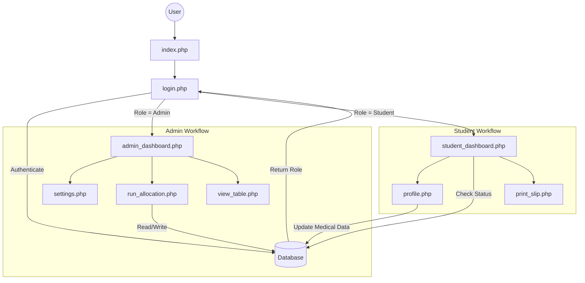

# FairMedAlloc - Project Structure & Architecture Guide

## 1. System Overview
Your FairMedAlloc system is a **Multi-Role Web Application** built using native PHP. The codebase is organized into distinct logical modules that communicate via a central database and session management.

---

## 2. The Core Backbone (Configuration & Shared Resources)
These files act as the foundation for the entire application.

| File / Directory | Purpose |
| :--- | :--- |
| **`db_config.php`** | The **Heart** of the system. It establishes the connection to the MySQL database. Every functional page includes this file first. |
| **`includes/header.php`** | Loads global HTML head elements, CSS (`main.css`), and Fonts. Ensures visual consistency. |
| **`includes/nav.php`** | A **Smart Sidebar** that checks `$_SESSION['user_type']` to decide whether to show Admin links (e.g., "Run Allocation") or Student links (e.g., "My Profile"). |
| **`includes/security_helper.php`** | Provides helper functions like `check_csrf()` to protect forms from attacks. |

---

## 3. The Entry Flow (Authentication)
How users enter the system and how the code decides where they go.

1.  **`index.php`**: The public landing page.
2.  **`login.php`**: The Gatekeeper.
    *   **Input**: Accepts Matric No (Student) or Username (Admin).
    *   **Logic**: Verifies password against `users` table.
    *   **Session**: Sets `$_SESSION['user_type']` to either `'admin'` or `'student'`.
    *   **Routing**:
        *   If **Admin** $\rightarrow$ Redirects to `admin_dashboard.php`
        *   If **Student** $\rightarrow$ Redirects to `student_dashboard.php`

---

## 4. The Admin Ecosystem
Files dedicated to the Administrator's workflow.

*   **`admin_dashboard.php`**: **Command Center**. Shows high-level statistics (Total Students, Bed Availability).
*   **`run_allocation.php`**: **Logic Engine**. fetches unscored students, calculates urgency based on medical data, and assigns rooms.
*   **`view_table.php`**: **Reporting**. Displays the Master List of all students and their allocation status.
*   **`settings.php`**: **Configuration**. Allows changing global rules (e.g., "Allocation Mode: Open/Closed").

---

## 5. The Student Ecosystem
Files dedicated to the Student's workflow.

*   **`student_dashboard.php`**: **Personal Home**. Checks `allocations` table.
    *   *If Allocated*: Shows Room Number and "Print" button.
    *   *If Pending*: Shows status message.
*   **`profile.php`**: **Data Entry**. The most critical file for the algorithm. Collects medical info used by `run_allocation.php`.
*   **`print_slip.php`**: **Output**. Generates the official printable allocation slip.

---

## 6. Visual Data Flow

